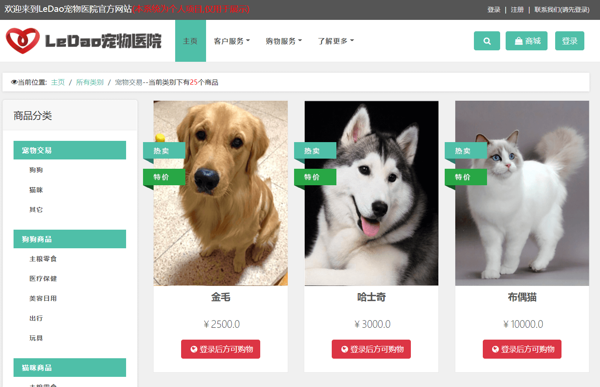
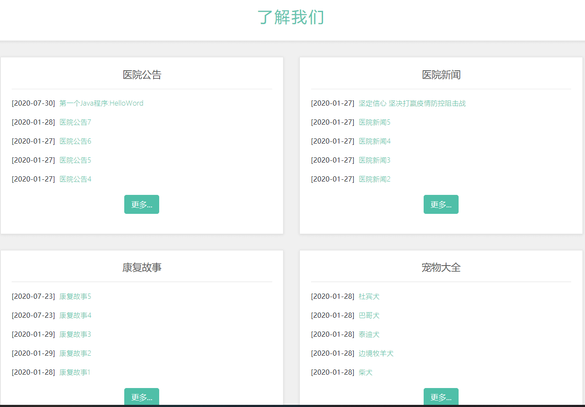
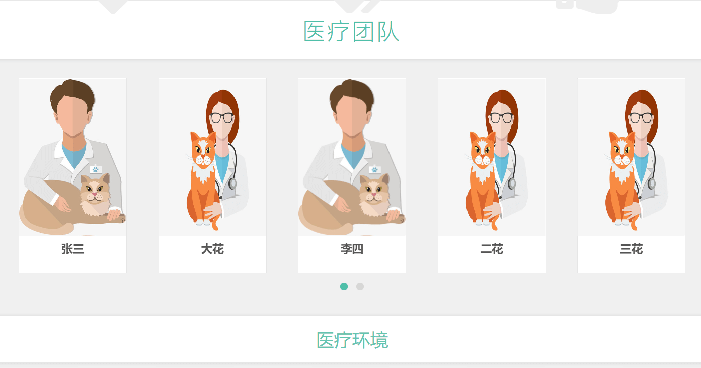
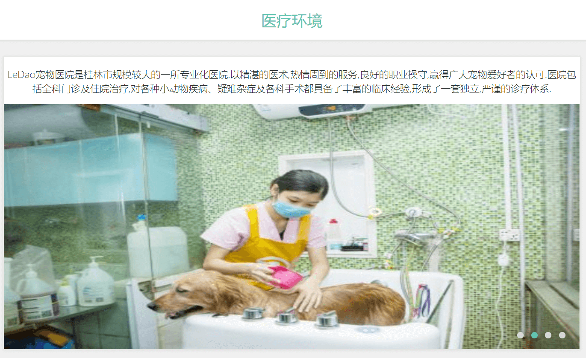
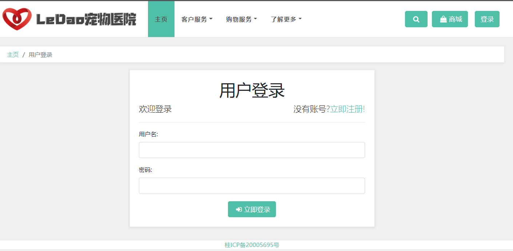
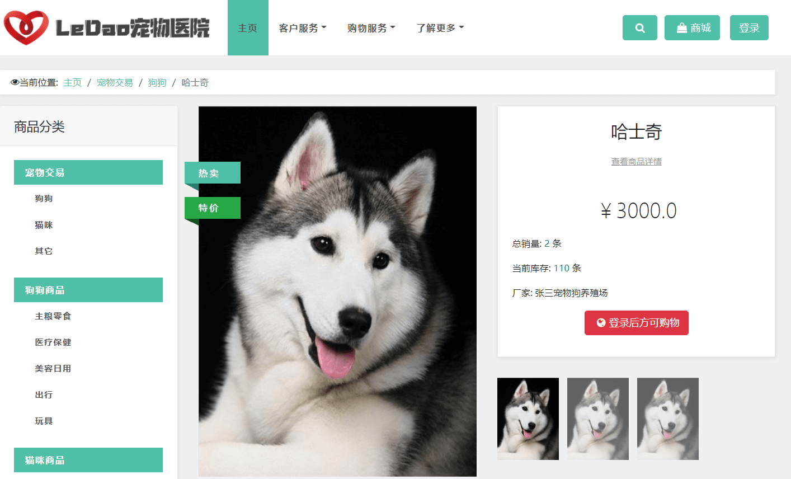
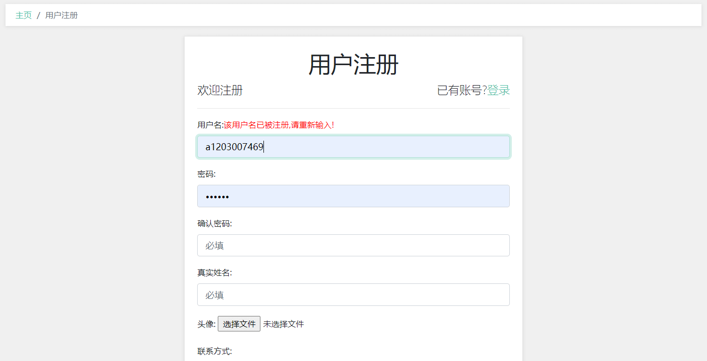
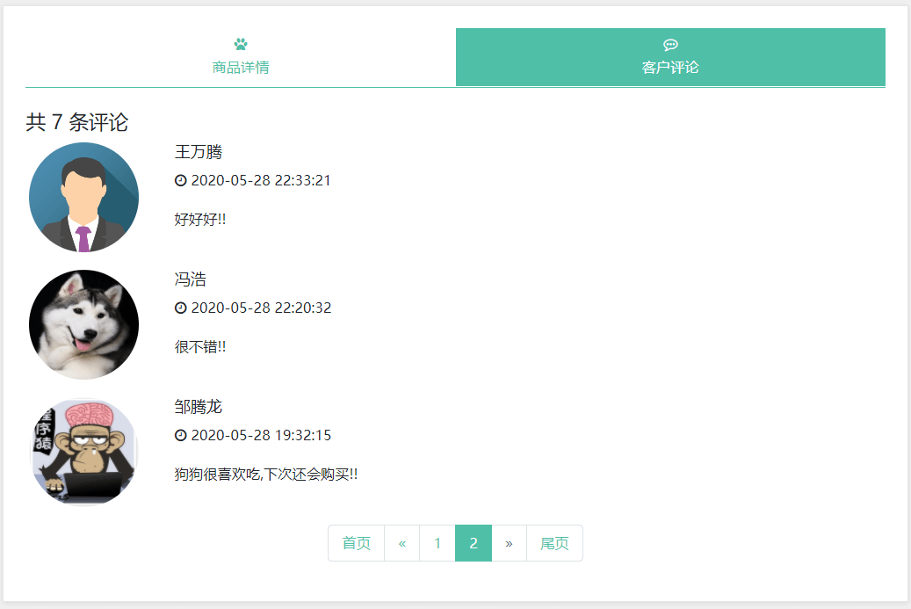

基于Springboot的宠物医院管理系统
=
### 完整代码获取地址：从戎源码网 ([https://armycodes.com/](https://armycodes.com/))
### 作者微信：19941326836  QQ：952045282 
### 承接计算机毕业设计、Java毕业设计、Python毕业设计、深度学习、机器学习
### 选题+开题报告+任务书+程序定制+安装调试+论文+答辩ppt 一条龙服务
### 所有选题地址https://github.com/nature924/allProject

一、项目介绍
---
基于SpringBoot框架的宠物医院管理系统，有美容师、医生、主管、仓库管理员4个角色，主要功能如下

### 【用户】
主页
客户服务
购物服务
了解更多
个人信息
我的宠物
我的收藏
我的订单
退货申请
我的评价
我的消息
我的留言
预约记录
问诊记录

【管理员】
系统菜单
进货管理
进货入库
退货出库
进货单据查询
退货单据查询
当前库存查询
销售管理
销售出库
客户退货
销售单据查询
客户退货查询
当前库存查询
库存管理
商品报损
商品报溢
库存报警
报损报溢查询
当前库存查询
统计报表
供应商统计
客户统计
商品采购统计
商品销售统计
按日统计分析
按月统计分析
基础资料
供应商管理
客户管理
商品管理
期初库存
轮播图管理
设备类型管理
写文章
文章管理
可文章类型管理
客户留言管理
设备管理
设备使用管理
设备使用记录管理
设备管理
动设备使用管理
设备使用记录管理
医院用品管理
医院用品出入库管理
医院用品出入库记录
客户消息管理
电客户订单处理
日客户支付记录管理
客户评价管理
品客户退货申请管理
预约服务
预约单管理
看病服务
问诊记录管理
病历单管理
以化验记录管理
疫苗注射记录管理
客户回访记录管理
寄养记录管理
系统管理
角色管理
用户管理
系统日志

二、项目技术
---
- 编程语言：Java
- 数据库：MySQL
- 项目管理工具：Maven
- 前端技术：VUE、HTML、Jquery、Bootstrap
- 后端技术：Spring、SpringMVC、MyBatis

三、运行环境
---
- 操作系统：Windows、macOS都可以
- JDK版本：JDK1.8以上都可以
- 开发工具：IDEA、Ecplise、Myecplise都可以
- 数据库: MySQL5.7以上都可以
- Tomcat：任意版本都可以
- Maven：任意版本都可以

四、运行截图
---

### 程序截图：

